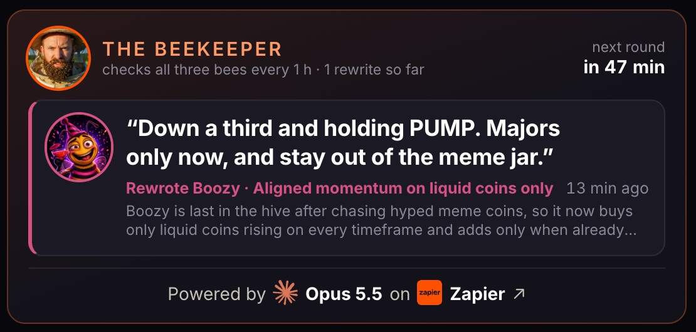
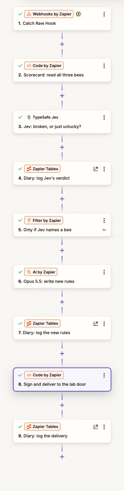
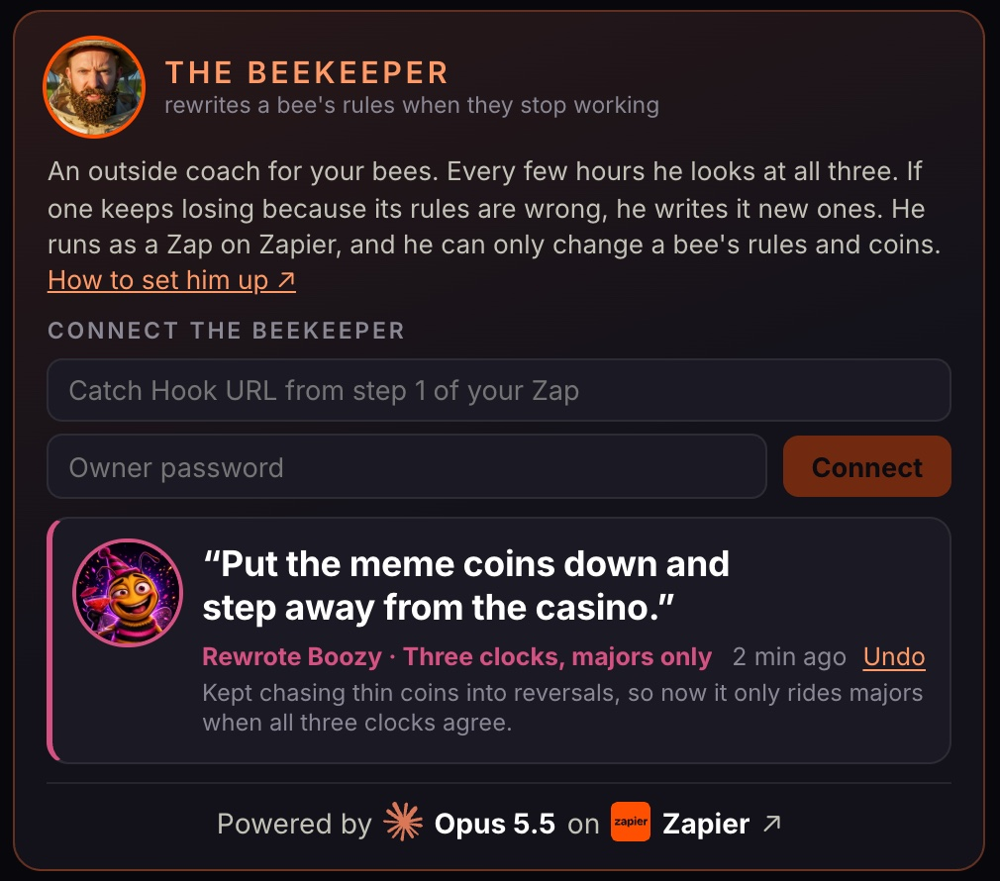

# The Beekeeper

The Beekeeper is an outside coach for your three bees. Every few hours he looks at all of them, and if one keeps
losing because its rules are wrong, he writes it new rules. He runs as a Zap on Zapier: Jev picks the bee, and
Claude Opus 5.5 writes the rules.

He is optional. Your bees trade the same without him. He works in paper trading (the default) exactly as he does
with real money.

[](https://www.youtube.com/watch?v=cTUnM9trqfs)

**Watch the video:** [youtube.com/watch?v=cTUnM9trqfs](https://www.youtube.com/watch?v=cTUnM9trqfs)



## What you need

- **A Zapier account** on a plan that includes Premium AI models. The Zap uses Claude Opus 5.5.
- **A TypeSafe key for Jev.** The same kind of key your bees use. Get one at
  [console.typesafe.ai/keys](https://console.typesafe.ai/keys).
- **A running beebots** that the internet can reach. A server from the one-click deploy is fine. A copy running on
  your own laptop is not: Zapier has to be able to call it.
- **Your owner password.** The one you picked on Setup.

## Set it up in 5 steps

1. **Copy the Zap.** Open [mrc.fm/beekeeper](https://mrc.fm/beekeeper) and copy the Zap into your Zapier account.
2. **Connect Jev.** Open step 3 of the Zap. Connect TypeSafe Jev with your key.
3. **Keep or drop the diary.** The template makes a Zapier Table for you and points steps 4, 7 and 9 at it. Every
   round is written there. If you do not want a diary, delete those three steps.
4. **Publish, then copy the hook URL.** Publish the Zap. Open step 1 and copy the Catch Hook URL. Treat that URL
   like a password: anyone who has it can start your Zap.
5. **Paste it into your dashboard.** Open your beebots dashboard. Find the Beekeeper card at the top of the right
   rail. Paste the URL into **Connect the Beekeeper**, type your owner password, and press **Connect**.

That is all. Your dashboard sends its own address along, so you never type it. The first round starts about a minute
later. After that he comes round every 4 hours.





## What each step of the Zap does

Your beebots starts every round. It calls the Zap's hook and sends two things: its own address, and a key that is
good for 15 minutes. So the Zap holds no secret and no address of its own.

| step | name | what it does |
|---|---|---|
| 1 | Catch Hook | Waits for your beebots to call. This is the trigger. |
| 2 | Scorecard: read all three bees | Reads the scorecard from your beebots: each bee's results, its rules, and whether it may be rewritten. |
| 3 | Jev: broken, or just unlucky? | Jev answers three questions. Is a bee broken? Which one? How badly is it doing? |
| 4 | Diary: log Jev's verdict | Writes Jev's answers to the diary table. |
| 5 | Only if Jev names a bee | Stops here when Jev says leave them alone, or is not sure, or names a bee that is locked. |
| 6 | Opus 5.5: write new rules | Claude Opus 5.5 writes new rules for that one bee, with a one-line reason. |
| 7 | Diary: log the new rules | Writes the new rules to the diary. |
| 8 | Sign and deliver to the lab door | Signs the new rules with the round's key and sends them to your beebots. |
| 9 | Diary: log the delivery | Writes down what your beebots answered. |

Most rounds stop at step 5. That is normal. A losing bee is usually unlucky, not broken.

The Beekeeper also comes early when a bee is sent home for the day or retires. He does that at most once every
30 minutes.

## What it costs in Zapier tasks

| round | tasks | why |
|---|---|---|
| A quiet round (nothing rewritten) | 2 | The scorecard Code step and the Jev step. |
| A round with a rewrite | 8 | The 2 above, plus Opus 5.5 (a Premium model) and the delivery Code step. |

Both numbers are what Zapier billed on real runs. The trigger, the Filter step and the three Tables steps are free.

At one round every 4 hours, a quiet day is 12 tasks. Each rewrite adds 6. A round where every bee is locked costs
nothing: your beebots does not call the Zap at all. Three bees can each be rewritten once a day at most, so the
ceiling is about 30 tasks a day.

To change how often he comes round, set `BEEKEEPER_EVERY_HOURS` (see [`.env.example`](../.env.example)).

## The safety rules

These are enforced by your beebots, not by the Zap. A Zap that misbehaves cannot get around them.

- **Rules text and a coin list. Nothing else.** He can never change leverage, stops, position size, trade caps, the
  daily loss stop, retirement, or paper versus real money. A request that tries is refused.
- **One rewrite per bee every 20 hours.** New rules get a day to prove themselves.
- **His rules replace yours while they are live.** Your own rules from Setup are kept, and come back when you undo.
- **Coins can only get narrower.** He can only pick coins that the bee's style can trade. If you gave the bee a coin
  list on Setup, he can only pick from that list. If none of his coins fit, the bee keeps your coins.
- **A single-use, 15-minute key.** Each round has its own key. It works for one rewrite, for 15 minutes. Three
  refused tries kill it early.
- **Retired bees are left alone.** So is every bee once you start closing the experiment.
- **Everything is on the record.** Every round shows on the Beekeeper card. The Zap's diary table keeps the full
  detail.

### Undo a rewrite

You can always put a bee back.

1. On the Beekeeper card, find the rewrite. Press **Undo** next to it.
2. Type your owner password and press **Undo**.

The bee goes back to the rules it had before that rewrite. If the Beekeeper had rewritten it before, that is his
earlier rewrite, and you can press **Undo** again. If not, it is your own rules from Setup, exactly as you saved them.
The change takes effect on the bee's next decision, a few seconds later.

After an undo, the Beekeeper leaves that bee alone for 20 hours.

Two more things to know:

- **Disconnect** stops the rounds. It does not undo anything. Rewrites stay until you undo them.
- **Running Setup again** drops every rewrite from before. Your new rules stand.

The same undo from a terminal, if you prefer (the password goes in a header, URL-encoded):

```sh
curl -X POST https://your-beebots/keeper/rollback \
  -H 'content-type: application/json' \
  -H 'x-owner-password: your%20password' \
  -d '{"bee":"bee2"}'
```

Bees are `bee1`, `bee2` and `bee3`, left to right on your dashboard.

### The owner controls

When the Beekeeper is connected, the card has two more controls. Both need your owner password.

- **Call him now** starts a round straight away. It costs the same tasks as any round.
- **Disconnect** stops the rounds and forgets the hook URL.

Eight wrong passwords lock every owner control for 15 minutes.

## What is sent, and what is read

- **To your Zap:** your beebots' address and the round's key, each round.
- **To anyone who asks:** the scorecard at `/keeper/scorecard`. It holds what your dashboard already shows: each
  bee's results and rules. No keys.
- **Read from the Hive:** while the Beekeeper is connected, your beebots reads the public Hive board so he can borrow
  ideas from the top bees. It only reads. It sends nothing about you, and it works whether or not you joined the
  Hive.

The hook URL is never shown on the dashboard and never written to the log.

Use a domain with HTTPS if you can (`PUBLIC_DOMAIN` in the README). Without it, your owner password travels over
plain HTTP when you type it.

## Troubleshooting

**The card says "No answer".** Your beebots called the hook and got no good reply. The hook URL is wrong, or the Zap
is switched off or not published. Check both, then connect again with the right URL. A scheduled round that fails is
tried again 10 minutes later.

**The card says "Bounced".** The Zap delivered new rules and your beebots refused them. Read the reason. It is in the
Zap's run history (step 8, `door_reply`), in the diary table, and in the engine's log
(`docker compose logs engine`). The usual reasons:

- `changed less than 20 hours ago`: that bee is still locked.
- `not a live crypto X-Perp`: Opus named a coin that is not tradable right now.
- `rules must be 10-500 characters`: the new rules were too short or too long.
- `is retired`: the bee has retired.

He tries again next round.

**Every round says "Left them alone".** Usually that is the right call. If it never changes, open the Zap's run
history. If step 2 fails, Zapier cannot reach your server. Open your dashboard on its public address, then
Disconnect and Connect again.

**"Zapier cannot reach this address" when you connect.** You opened the dashboard on a local address, like
`localhost`. Open it on your server's IP or domain and connect from there.

**"BEEKEEPER_WEBHOOK_URL is set in this server's environment."** Someone set the hook in `.env`. Change it there, or
remove it and use the dashboard.

**"This server has no owner password yet."** Run Setup again to pick one (see the README), or set `OWNER_PASSWORD`.

## Settings

Most people need none of these. They go in `.env`, and anything set there wins over the dashboard.

| setting | default | what it does |
|---|---|---|
| `BEEKEEPER_WEBHOOK_URL` | blank | The Zap's Catch Hook URL. Set it here instead of on the dashboard if you prefer. |
| `PUBLIC_URL` | blank | Where the Zap finds your beebots. Blank means `https://<PUBLIC_DOMAIN>` when that is set, else the address you connected from. |
| `BEEKEEPER_EVERY_HOURS` | `4` | Hours between rounds. |
| `BEEKEEPER_RAMP_START` | blank | An optional warm-up. See [`.env.example`](../.env.example). |

The dashboard saves its own copy in `keeper.json`, next to `settings.json` in the data volume.

## Build the Zap by hand

You do not have to copy the shared Zap. Everything it contains is in the [`beekeeper/`](../beekeeper) folder: the
two code steps, the prompt for Opus 5.5, and the questions for Jev.

## The routes

| route | who can call it | what it does |
|---|---|---|
| `GET /keeper/scorecard` | anyone | What the Zap reads before a round. |
| `POST /lab/overlay` | the Zap, with a round's key | Delivers one rewrite: rules text and coins for one bee. |
| `POST /keeper/connect` | you (owner password) | Connects the Zap: `{ "hookUrl": "...", "publicUrl": "..." }`. |
| `POST /keeper/disconnect` | you (owner password) | Stops the rounds. |
| `POST /keeper/round` | you (owner password) | Starts a round now. |
| `POST /keeper/rollback` | you (owner password) | Undoes the latest rewrite of one bee: `{ "bee": "bee2" }`. |

The Beekeeper is a game mechanic, not a signal service. **Not financial advice.**
